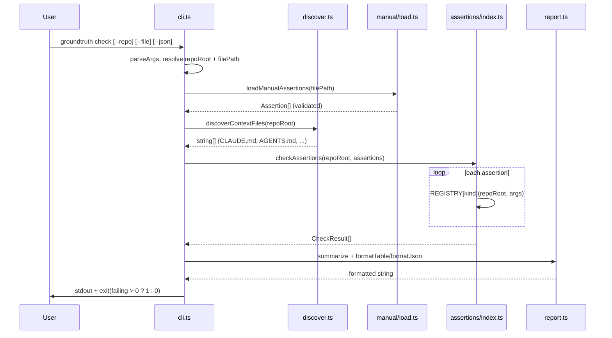
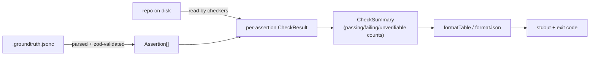

# System overview

> **Summary:** `groundtruth check` reads a `.groundtruth.jsonc` assertions
> file, runs each assertion's checker against the repo on disk, and prints a
> pass/fail/unverifiable report. One process, one pass, no persistence, no
> network. Source of truth for every claim below is `src/`, linked inline.

## Application boundary

groundtruth is a dev-time and CI-time CLI, distributed as the
`@groundtruth-sh/cli` npm package (see root [README § Install](../../README.md#install)).
It has no server component, no deployed service, and no runtime database.
Its only inputs are: the target repo's files on disk, and a
`.groundtruth.jsonc` assertions file. Its only output is stdout and a
process exit code. This is why [`docs/README.md`](../README.md)'s taxonomy
has no `infrastructure/` or `operations/` folder yet — there is nothing
those folders would document.

## Components

| Component | File | Responsibility |
|---|---|---|
| Entry point | [`src/cli.ts`](../../src/cli.ts) | Arg parsing, orchestration, exit code |
| Context discovery | [`src/discover.ts`](../../src/discover.ts) | Finds which agent-context file(s) exist (informational only — see [ADR-0001](../adr/0001-hand-authored-assertions-before-llm-extraction.md)) |
| Assertion loading | [`src/manual/load.ts`](../../src/manual/load.ts), [`src/manual/schema.ts`](../../src/manual/schema.ts) | Parses and validates `.groundtruth.jsonc` |
| Checker registry | [`src/assertions/index.ts`](../../src/assertions/index.ts) | Dispatches each assertion to its kind-specific checker |
| Checkers | [`src/assertions/*.ts`](../../src/assertions/) | One file per assertion kind (see [`features/check-command.md`](../features/check-command.md) for the list) |
| Reporting | [`src/report.ts`](../../src/report.ts) | Aggregates results, formats table/JSON output |
| Public exports | [`src/index.ts`](../../src/index.ts) | Programmatic API surface for consumers other than the CLI |

## Request flow

## Data flow

No data is written back anywhere — groundtruth only reads the target repo
and the assertions file. It never mutates either.

## Extension point: assertion kinds

Every assertion kind is registered in exactly one place —
`REGISTRY` in [`src/assertions/index.ts`](../../src/assertions/index.ts) —
keyed against the `AssertionKind` union in
[`src/types.ts`](../../src/types.ts). Because `Assertion` is a mapped type
over `AssertionKind`, adding a new kind without adding its checker to
`REGISTRY` is a TypeScript compile error, not a silent runtime gap. This is
the mechanism, not a convention someone has to remember — see
[ADR-0003](../adr/0003-regex-based-symbol-matching-for-mvp.md) for the
tradeoff this bought when `symbol_at_path` was added.

## Deployment

The CLI itself has no deployment: it's installed by consumers via
`pnpm add -D @groundtruth-sh/cli` (root
[README § Install](../../README.md#install)) and invoked locally or in CI
as a shell command. Releases are manual — version bump, `npm publish`,
tag, GitHub release; see
[Release process](https://groundtruth.sh/project/release-process). There
is no automated release workflow.

This repository does have one deployed artifact: the documentation site
at [`site/`](../../site/), a static VitePress build published to GitHub
Pages via [`.github/workflows/deploy-site.yml`](../../.github/workflows/deploy-site.yml)
on every push to `main`. It has no server component either — it's static
HTML/CSS/JS served by GitHub Pages, not a running process.
