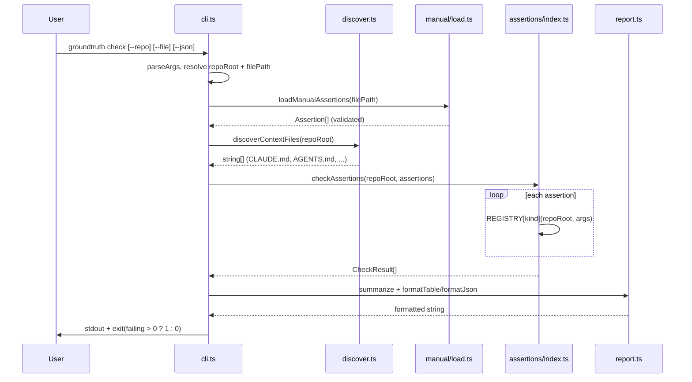
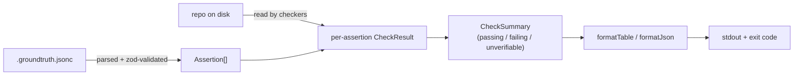

# Architecture overview

groundtruth is a single-process CLI: no server, no database, no network
calls, nothing running in the background. `groundtruth check` reads a
`.groundtruth.jsonc` file and the target repo's files on disk, runs each
assertion's checker, and exits. Everything below is sourced from
[`src/`](https://github.com/jaystewart-dev/groundtruth/tree/main/src) —
follow the links to the actual code rather than trusting this page to
stay perfectly in sync as the source evolves.

## Application boundary

groundtruth is a dev-time and CI-time tool, distributed as an npm package
(currently git-installed — see [Getting started](/guide/getting-started)).
It has no deployed service and no runtime database. Its only inputs are
the target repo's files and a `.groundtruth.jsonc` assertions file; its
only outputs are stdout and a process exit code. It never writes back to
either the target repo or the assertions file.

## Components

| Component | Source | Responsibility |
|---|---|---|
| Entry point | [`src/cli.ts`](https://github.com/jaystewart-dev/groundtruth/blob/main/src/cli.ts) | Arg parsing, orchestration, exit code |
| Context discovery | [`src/discover.ts`](https://github.com/jaystewart-dev/groundtruth/blob/main/src/discover.ts) | Finds which agent-context file(s) exist (informational today) |
| Assertion loading | [`src/manual/load.ts`](https://github.com/jaystewart-dev/groundtruth/blob/main/src/manual/load.ts), [`schema.ts`](https://github.com/jaystewart-dev/groundtruth/blob/main/src/manual/schema.ts) | Parses and zod-validates `.groundtruth.jsonc` |
| Checker registry | [`src/assertions/index.ts`](https://github.com/jaystewart-dev/groundtruth/blob/main/src/assertions/index.ts) | Dispatches each assertion to its kind-specific checker |
| Checkers | [`src/assertions/*.ts`](https://github.com/jaystewart-dev/groundtruth/tree/main/src/assertions) | One file per assertion kind — see [Assertion kinds](/reference/assertion-kinds) |
| Reporting | [`src/report.ts`](https://github.com/jaystewart-dev/groundtruth/blob/main/src/report.ts) | Aggregates results, formats table/JSON output |
| Public exports | [`src/index.ts`](https://github.com/jaystewart-dev/groundtruth/blob/main/src/index.ts) | Programmatic API surface — see [CLI reference](/reference/cli#programmatic-api) |

## Request flow

## Data flow

## Extension point: assertion kinds

Every assertion kind is registered in exactly one place — `REGISTRY` in
`src/assertions/index.ts` — keyed against the `AssertionKind` union in
`src/types.ts`. Because `Assertion` is a mapped type over
`AssertionKind`, adding a new kind without adding its checker to
`REGISTRY` fails `tsc`, not the runtime. See
[ADR-0003](/architecture/decisions#adr-0003-regex-based-symbol-matching-for-mvp)
for a real example of this paying off — swapping `symbol_at_path`'s regex
implementation for an AST parser later is a scoped, single-file change.

## CI/CD and deployment

No CD pipeline exists for the CLI itself yet beyond `pnpm build` (tsc →
`dist/`) — there's nothing to deploy, since groundtruth has no server
component. This documentation site is the one thing in this repository
that *does* have a deploy pipeline: it builds and publishes to GitHub
Pages on every push to `main` via
[`.github/workflows/deploy-site.yml`](https://github.com/jaystewart-dev/groundtruth/blob/main/.github/workflows/deploy-site.yml).
Source code itself is verified on every pull request via
[`.github/workflows/ci.yml`](https://github.com/jaystewart-dev/groundtruth/blob/main/.github/workflows/ci.yml)
(typecheck + test).

## What this page deliberately omits

No "infrastructure" or "external integrations" section, because
groundtruth calls no external service and provisions no infrastructure —
see [`docs/README.md`](https://github.com/jaystewart-dev/groundtruth/blob/main/docs/README.md#folder-taxonomy)
in the repo for the full reasoning on what documentation categories are
populated versus deliberately reserved for later.
