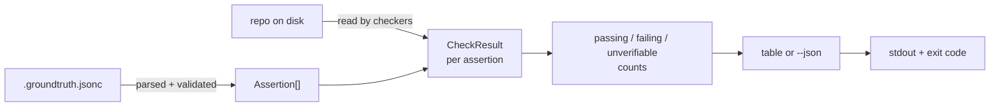

<div class="badge-row">

[](https://github.com/jaystewart-dev/groundtruth/stargazers)
[](https://github.com/jaystewart-dev/groundtruth/releases)
[](https://www.npmjs.com/package/@groundtruth-sh/cli)
[](https://github.com/jaystewart-dev/groundtruth/actions/workflows/ci.yml)
[](https://github.com/jaystewart-dev/groundtruth/blob/main/LICENSE)

</div>

## The problem

Every AI coding agent workflow now leans on a context file — `CLAUDE.md`,
`AGENTS.md`, `.cursor/rules`, `.github/copilot-instructions.md` — that
tells the agent facts about the repo it can't infer from the code alone:
which environment variables are dead, which vendor was decommissioned,
which script is the one true pre-push check, which file owns a piece of
business logic.

That file rots exactly the way any other documentation rots as the
codebase changes underneath it. Ordinary doc rot is low-stakes — a human
reads a stale line, gets briefly confused, moves on. Agent-context rot is
different in kind, not degree: an agent doesn't get confused by a false
statement, it *acts* on it. A sentence that used to be true — "the
Supabase project is torn down, don't reintroduce it" — read as ground
truth by an agent that has no way to know it's now false, is a standing
instruction to eventually undo whatever kept it false.

This isn't hypothetical. groundtruth exists because a real audit of a
production repository
([AgendaProfe](https://agendaprofe.com)) found four
live instances of exactly this pattern in one file: two decommissioned
vendors' environment variables still declared in build tooling months
after teardown, a leftover MCP server config for a torn-down database, and
a memory file directly contradicting the project's own stated PR policy.
Nothing in the toolchain caught any of it — because nothing was checking.

## The solution

groundtruth treats your context file the way a type checker treats your
source: statements aren't just prose, they're claims that can be
mechanically true or false, and a build should fail the moment one isn't.

`groundtruth check` reads a `.groundtruth.jsonc` file — an array of
**assertions**, each pairing a `claim` (the original sentence, for
humans) with a `kind` and `args` (a mechanical check) and a `source`
(exactly which line made the claim). It runs every assertion against the
repo on disk and reports `passing`, `failing`, or `unverifiable` —
worst-first, so nothing you need to act on scrolls past unseen.

```
Context layer: CLAUDE.md
9 assertion(s) — 3 passing, 6 failing, 0 unverifiable

✗ CLAUDE.md#L7  "Do NOT reintroduce a Supabase/Vercel code path or env var."
  SUPABASE_URL found in turbo.json
✗ CLAUDE.md#L8  "The Supabase project is torn down; do not add an MCP server for it."
  .mcp.json exists but should not
✓ CLAUDE.md#L9  "`pnpm verify:push` runs typecheck + unit."
  scripts.verify:push = "pnpm typecheck && pnpm test"
```

What makes this more than a linter is the handling of the middle case.
Most claims in a context file *can't* be mechanically verified yet — no
kind covers them. groundtruth's answer is to report those as
`unverifiable`, always, loudly, and to never let one fail your build. The
alternative — silently skipping what the checker can't verify — is the
exact failure this tool exists to prevent, just moved one layer up. See
[why](/architecture/decisions#adr-0002-unverifiable-assertions-never-fail-but-always-report)
this is a hard rule, not a default that got left in.

Today's MVP is layer one of a three-layer design — see the
[roadmap](/project/roadmap) for the contradiction-detection and
context-economics layers that build on top of it.

## How it fits together



One process, one pass over the filesystem, no network calls, no database.
Full breakdown of every component: [Architecture overview](/architecture/overview).

## Try it in under five minutes

```bash
pnpm add -D @groundtruth-sh/cli
cp node_modules/@groundtruth-sh/cli/.groundtruth.jsonc.example .groundtruth.jsonc
# edit .groundtruth.jsonc to match claims in your own CLAUDE.md
groundtruth check
```

Full walkthrough with a real `.groundtruth.jsonc`:
[Getting started →](/guide/getting-started)

Then put it on every pull request — two lines of YAML, no install step:

```yaml
      - uses: actions/checkout@v4
      - uses: jaystewart-dev/groundtruth@v%%GT_VERSION%%
```

[GitHub Action →](/guide/github-action)

## Where it comes from

groundtruth is maintained by [Jay Stewart](https://jaystewart.dev), who runs
his own production systems with AI agents writing most of the code — the
audit that motivated the tool is written up, with counted figures, in
[a public case study](https://jaystewart.dev/work/agent-operated-codebase/).
The tool is free, MIT-licensed and complete on its own, and it is the same
check the author runs against his own repositories in CI.

<style>
.badge-row {
  display: flex;
  flex-wrap: wrap;
  gap: 8px;
  justify-content: center;
  margin: -24px 0 48px;
}
.badge-row img { height: 22px; }
</style>
